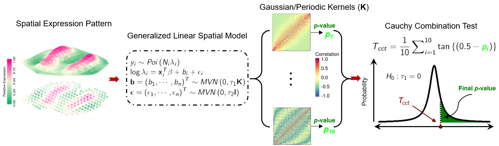

---
#
# By default, content added below the "---" mark will appear in the home page
# between the top bar and the list of recent posts.
# To change the home page layout, edit the _layouts/home.html file.
# See: https://jekyllrb.com/docs/themes/#overriding-theme-defaults
#
layout: home
author: "Lulu Shang, Jennifer A. Smith and Xiang Zhou"
date: '2019-07-17'
fontsize: 10pt
linkcolor: blue
mainfont: Times
output:
pdf_document: default
html_document: default
md_document:
variant: markdown_github
---



## CoCoNet

**CoCoNet** is an efficient method to facilitate the identification of trait-relevant tissues or cell types. We apply CoCoNet for an in-depth analysis of four neurological disorders and four autoimmune diseases, where we integrate the corresponding GWASs with bulk RNAseq data from 38 tissues and single cell RNAseq data from 10 cell types. 


## Example: GTEx tissues in GWAS trait BIPSCZ

Load the `CoCoNet` package and data, which can be downloaded from this google drive [here](https://drive.google.com/open?id=1XkyFp8_k1FLoYiaL_PYjYzusYoc8Lwz_).
```R
    library('CoCoNet')
    load("tissue_net.RData")
    load("tissue_name.RData")
    load("outcome_tissue_scale.RData")
```

In total we have 38 tissues, the network are ordered by the tissue names
```R
> tissue_name
 [1] "Adipose_subcutaneous"      "Adipose_visceral"         
 [3] "Adrenal_gland"             "Artery_aorta"             
 [5] "Artery_coronary"           "Artery_tibial"            
 [7] "Brain_other"               "Brain_cerebellum"         
 [9] "Brain_basal_ganglia"       "Breast"                   
[11] "Lymphoblastoid_cell_line"  "Fibroblast_cell_line"     
[13] "Colon_sigmoid"             "Colon_transverse"         
[15] "Gastroesophageal_junction" "Esophagus_mucosa"         
[17] "Esophagus_muscularis"      "Heart_atrial_appendage"   
[19] "Heart_left_ventricle"      "Kidney_cortex"            
[21] "Liver"                     "Lung"                     
[23] "Minor_salivary_gland"      "Skeletal_muscle"          
[25] "Tibial_nerve"              "Ovary"                    
[27] "Pancreas"                  "Pituitary"                
[29] "Prostate"                  "Skin"                     
[31] "Intestine_terminal_ileum"  "Spleen"                   
[33] "Stomach"                   "Testis"                   
[35] "Thyroid"                   "Uterus"                   
[37] "Vagina"                    "Whole_blood"  
```
The first tissue is "Adipose_subcutaneous", which looks like this:
```
> tissue_net[[1]][1:4,1:4]
                ENSG00000106546 ENSG00000160224 ENSG00000156150 ENSG00000052850
ENSG00000106546               0               0               0               0
ENSG00000160224               0               0               0               0
ENSG00000156150               0               0               0               0
ENSG00000052850               0               0               0               0
```
